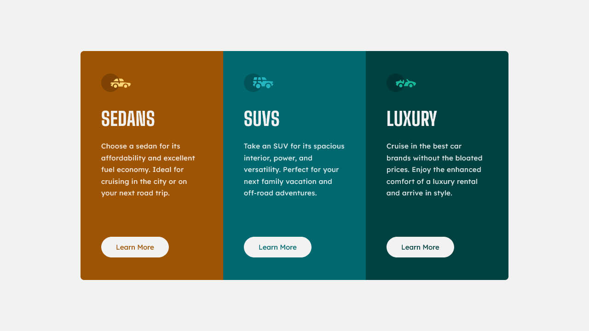

# 3-Column Preview Card Component

This is an implementation of the Frontend Mentor challenge: [3-Column Preview Card Component](https://www.frontendmentor.io/challenges/3column-preview-card-component-pH92eAR2-).

## Preview

## Description

[Frontend Mentor](https://www.frontendmentor.io/) provides challenges that developers can use to practice implementing designs as fully functional websites and applications.

This project is an implementation of the design: [3-Column Preview Card](https://www.frontendmentor.io/challenges/3column-preview-card-component-pH92eAR2-). It features a responsive design and hover/focus states for interactive components.

Note: Changes were made to the design to comply with WCAG accessibility standards.

This project was built with:

- HTML
- CSS
