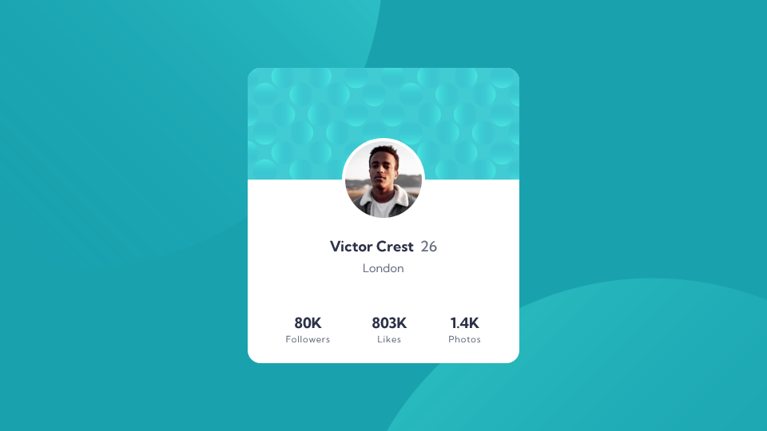

# Profile Card Component

This is an implementation of the Frontend Mentor challenge: [Profile Card Component](https://www.frontendmentor.io/challenges/profile-card-component-cfArpWshJ).

## Preview

## Description

[Frontend Mentor](https://www.frontendmentor.io/) provides challenges that developers can use to practice implementing designs as fully functional websites and applications.

This project is an implementation of the design: [Profile Card Component](https://www.frontendmentor.io/challenges/profile-card-component-cfArpWshJ). It features a responsive design.

This project was built with:

- HTML
- CSS
