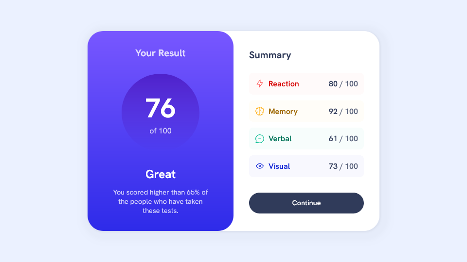

# Results Summary Component

This is an implementation of the Frontend Mentor challenge: [Results Summary Component](https://www.frontendmentor.io/challenges/results-summary-component-CE_K6s0maV).

## Preview

## Description

[Frontend Mentor](https://www.frontendmentor.io/) provides challenges that developers can use to practice implementing designs as fully functional websites and applications.

This project is an implementation of the design: [Results Summary Component](https://www.frontendmentor.io/challenges/results-summary-component-CE_K6s0maV). It features a responsive design and interactive button element.

Note: I have made a few changes to the original design in order to improve the accessibility.

This project was built with:

- HTML
- CSS
