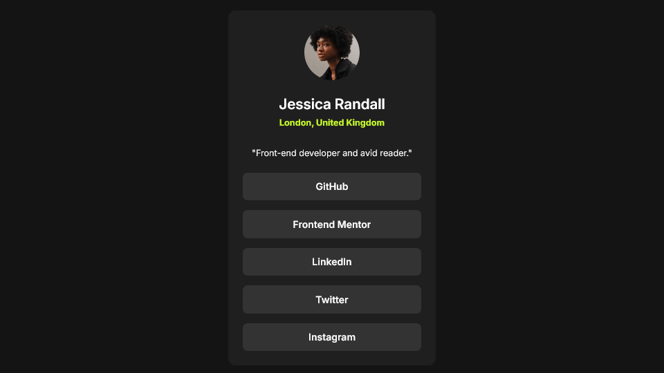

# Social Links Profile

This is an implementation of the Frontend Mentor challenge: [Social Links Profile](https://www.frontendmentor.io/challenges/social-links-profile-UG32l9m6dQ).

## Preview

## Description

[Frontend Mentor](https://www.frontendmentor.io/) provides challenges that developers can use to practice implementing designs as fully functional websites and applications.

This project is an implementation of the design: [Social Links Profile](https://www.frontendmentor.io/challenges/social-links-profile-UG32l9m6dQ). It features a responsive design and interactive button elements.

This project was built with:

- HTML
- CSS
